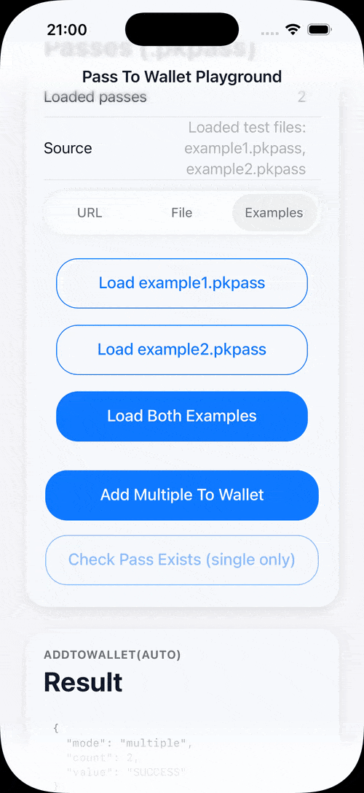

# [@belongnet/capacitor-pass-to-wallet](https://github.com/belongnet/capacitor-pass-to-wallet)

Capacitor plugin to add `.pkpass` files to Apple Wallet.

<div align="center">
  
</div>

## Overview

Adds `.pkpass` files to Apple Wallet from a Capacitor app, using either `base64` content or a local `file URI`.

- `addToWallet` for a single pass
- `addMultipleToWallet` for multiple passes
- `passExists` to check whether a pass is already in Wallet

## Quick start

```bash
bun add @belongnet/capacitor-pass-to-wallet
bunx cap sync
```

## Basic usage

For step-by-step tutorials, see [Adding Apple Wallet Passes](https://ionic.io/docs/tutorials/integrations/digital-passes/apple-wallet-passes/adding) and [Creating Apple Wallet Passes](https://ionic.io/docs/tutorials/integrations/digital-passes/apple-wallet-passes/creating).

### Add pass from base64

```ts
import { CapacitorPassToWallet } from '@belongnet/capacitor-pass-to-wallet';

await CapacitorPassToWallet.addToWallet({
  base64: passBase64,
});
```

### Add pass from local file

```ts
import { Filesystem, Directory } from '@capacitor/filesystem';
import { CapacitorPassToWallet } from '@belongnet/capacitor-pass-to-wallet';

const { uri } = await Filesystem.getUri({
  directory: Directory.Cache,
  path: 'passes/example.pkpass',
});

await CapacitorPassToWallet.addToWallet({
  filePath: uri,
});
```

### Add multiple passes

```ts
// base64 mode
await CapacitorPassToWallet.addMultipleToWallet({
  base64: [base64Pass1, base64Pass2],
});

// file mode
await CapacitorPassToWallet.addMultipleToWallet({
  filePaths: [uri1, uri2],
});
```

### Check if pass already exists

```ts
const result = await CapacitorPassToWallet.passExists({
  filePath: uri,
});

console.log(result.passExists);
```

> [!NOTE]
> iOS is implemented. Android implementation in this repository is currently a placeholder.

## Compatibility

| Capacitor Version | Plugin Version |
| ----------------- | -------------- |
| 7.x               | [package (v7)](https://github.com/atroo/capacitor-pass-to-wallet) |
| 8.x               | 8.x            |

## Requirements (Capacitor 8)

- `@capacitor/core` `>=8.0.0`
- iOS deployment target: `15.0+`
- Android `minSdkVersion`: `24+`
- Android build defaults in this plugin: `compileSdkVersion 36`, `targetSdkVersion 36`, Java `21`

## References

- **[atroo/capacitor-pass-to-wallet](https://github.com/atroo/capacitor-pass-to-wallet)** — Capacitor 7.x fork (`@atroo/capacitor-pass-to-wallet`).
- **[NitnelavAH/capacitor-pass-to-wallet](https://github.com/NitnelavAH/capacitor-pass-to-wallet)** — original plugin (Capacitor 4–7).

## API

<docgen-index>

* [`addToWallet(...)`](#addtowallet)
* [`addMultipleToWallet(...)`](#addmultipletowallet)
* [`passExists(...)`](#passexists)
* [`passExistsById(...)`](#passexistsbyid)
* [`canAddPasses()`](#canaddpasses)
* [`openPassInWallet(...)`](#openpassinwallet)
* [`removePass(...)`](#removepass)
* [`listPasses()`](#listpasses)
* [Interfaces](#interfaces)

</docgen-index>

<docgen-api>
<!--Update the source file JSDoc comments and rerun docgen to update the docs below-->

### addToWallet(...)

```typescript
addToWallet(options: AddToWalletOptions) => Promise<AddToWalletResult>
```

Opens Apple Wallet sheet for a single `.pkpass`.

| Param         | Type                                                              |
| ------------- | ----------------------------------------------------------------- |
| **`options`** | <code><a href="#addtowalletoptions">AddToWalletOptions</a></code> |

**Returns:** <code>Promise&lt;<a href="#addtowalletresult">AddToWalletResult</a>&gt;</code>

--------------------


### addMultipleToWallet(...)

```typescript
addMultipleToWallet(options: AddMultipleToWalletOptions) => Promise<AddToWalletResult>
```

Opens Apple Wallet sheet for multiple `.pkpass` files.

| Param         | Type                                                                              |
| ------------- | --------------------------------------------------------------------------------- |
| **`options`** | <code><a href="#addmultipletowalletoptions">AddMultipleToWalletOptions</a></code> |

**Returns:** <code>Promise&lt;<a href="#addtowalletresult">AddToWalletResult</a>&gt;</code>

--------------------


### passExists(...)

```typescript
passExists(options: AddToWalletOptions) => Promise<PassExistsResult>
```

Checks whether a pass already exists in Apple Wallet.

| Param         | Type                                                              |
| ------------- | ----------------------------------------------------------------- |
| **`options`** | <code><a href="#addtowalletoptions">AddToWalletOptions</a></code> |

**Returns:** <code>Promise&lt;<a href="#passexistsresult">PassExistsResult</a>&gt;</code>

--------------------


### passExistsById(...)

```typescript
passExistsById(options: PassIdentifierOptions) => Promise<PassExistsResult>
```

Checks whether a pass exists by identifier and optional serial number.

| Param         | Type                                                                    |
| ------------- | ----------------------------------------------------------------------- |
| **`options`** | <code><a href="#passidentifieroptions">PassIdentifierOptions</a></code> |

**Returns:** <code>Promise&lt;<a href="#passexistsresult">PassExistsResult</a>&gt;</code>

--------------------


### canAddPasses()

```typescript
canAddPasses() => Promise<CanAddPassesResult>
```

Returns whether device can add passes.

**Returns:** <code>Promise&lt;<a href="#canaddpassesresult">CanAddPassesResult</a>&gt;</code>

--------------------


### openPassInWallet(...)

```typescript
openPassInWallet(options: PassIdentifierOptions) => Promise<OpenPassInWalletResult>
```

Opens an existing pass in Apple Wallet by identifier.

| Param         | Type                                                                    |
| ------------- | ----------------------------------------------------------------------- |
| **`options`** | <code><a href="#passidentifieroptions">PassIdentifierOptions</a></code> |

**Returns:** <code>Promise&lt;<a href="#openpassinwalletresult">OpenPassInWalletResult</a>&gt;</code>

--------------------


### removePass(...)

```typescript
removePass(options: PassIdentifierOptions) => Promise<RemovePassResult>
```

Removes an existing pass from Apple Wallet by identifier.

| Param         | Type                                                                    |
| ------------- | ----------------------------------------------------------------------- |
| **`options`** | <code><a href="#passidentifieroptions">PassIdentifierOptions</a></code> |

**Returns:** <code>Promise&lt;<a href="#removepassresult">RemovePassResult</a>&gt;</code>

--------------------


### listPasses()

```typescript
listPasses() => Promise<ListPassesResult>
```

Lists wallet passes visible to the app.

**Returns:** <code>Promise&lt;<a href="#listpassesresult">ListPassesResult</a>&gt;</code>

--------------------


### Interfaces


#### AddToWalletResult

| Prop        | Type                | Description                                                           |
| ----------- | ------------------- | --------------------------------------------------------------------- |
| **`value`** | <code>string</code> | Operation status. Returns `"added"` when the pass sheet is presented. |


#### AddToWalletOptions

| Prop           | Type                | Description                                                                                                          |
| -------------- | ------------------- | -------------------------------------------------------------------------------------------------------------------- |
| **`base64`**   | <code>string</code> | Base64-encoded `.pkpass` file content. Optional when `filePath` is provided.                                         |
| **`filePath`** | <code>string</code> | Native file path/URI to a `.pkpass` file (for example from `Filesystem.getUri`). Optional when `base64` is provided. |


#### AddMultipleToWalletOptions

| Prop            | Type                  | Description                                                                            |
| --------------- | --------------------- | -------------------------------------------------------------------------------------- |
| **`base64`**    | <code>string[]</code> | List of base64-encoded `.pkpass` file contents. Optional when `filePaths` is provided. |
| **`filePaths`** | <code>string[]</code> | List of native file paths/URIs to `.pkpass` files. Optional when `base64` is provided. |


#### PassExistsResult

| Prop             | Type                 | Description                                              |
| ---------------- | -------------------- | -------------------------------------------------------- |
| **`passExists`** | <code>boolean</code> | `true` if the pass is already available in Apple Wallet. |


#### PassIdentifierOptions

| Prop                     | Type                | Description                                                              |
| ------------------------ | ------------------- | ------------------------------------------------------------------------ |
| **`passTypeIdentifier`** | <code>string</code> | Wallet pass type identifier (for example `pass.com.example.membership`). |
| **`serialNumber`**       | <code>string</code> | Optional serial number to target a specific pass instance.               |


#### CanAddPassesResult

| Prop               | Type                 | Description                                            |
| ------------------ | -------------------- | ------------------------------------------------------ |
| **`canAddPasses`** | <code>boolean</code> | `true` when the device can present add-to-wallet flow. |


#### OpenPassInWalletResult

| Prop         | Type                 | Description                                                        |
| ------------ | -------------------- | ------------------------------------------------------------------ |
| **`opened`** | <code>boolean</code> | `true` when a matching pass was found and open action was started. |


#### RemovePassResult

| Prop          | Type                 | Description                                          |
| ------------- | -------------------- | ---------------------------------------------------- |
| **`removed`** | <code>boolean</code> | `true` when a matching pass was removed from wallet. |


#### ListPassesResult

| Prop         | Type                             | Description                                     |
| ------------ | -------------------------------- | ----------------------------------------------- |
| **`passes`** | <code>WalletPassSummary[]</code> | Passes currently visible in the wallet library. |


#### WalletPassSummary

| Prop                     | Type                | Description                                                              |
| ------------------------ | ------------------- | ------------------------------------------------------------------------ |
| **`passTypeIdentifier`** | <code>string</code> | Wallet pass type identifier (for example `pass.com.example.membership`). |
| **`serialNumber`**       | <code>string</code> | Pass serial number.                                                      |
| **`organizationName`**   | <code>string</code> | Organization name from pass payload when available.                      |

</docgen-api>

---

**License:** MIT
